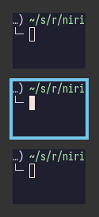
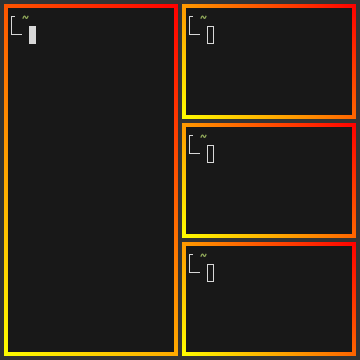
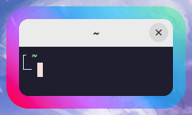

### Overview

In the `layout {}` section you can change various settings that influence how windows are positioned and sized.

Here are the contents of this section at a glance:

```kdl
layout {
    gaps 16
    empty-workspace-above-first
    default-column-display "tabbed"
    background-color "#003300"

    preset-column-widths {
        proportion 0.33333
        proportion 0.5
        proportion 0.66667
    }

    default-column-width { proportion 0.5; }

    preset-window-heights {
        proportion 0.33333
        proportion 0.5
        proportion 0.66667
    }

    focus-ring {
        // off
        on
        width 4
        active-color "#7fc8ff"
        active-indicator-color "#2e9ef4"
        // focused-inactive-color "#505050"
        inactive-color "#505050"
        urgent-color "#9b0000"
        // active-gradient from="#80c8ff" to="#bbddff" angle=45
        // active-indicator-gradient from="#2e9ef4" to="#7fc8ff" angle=45
        // inactive-gradient from="#505050" to="#808080" angle=45 relative-to="workspace-view"
        // urgent-gradient from="#800" to="#a33" angle=45
    }

    tab-bar {
        // off
        on
        // show-in-split
        height 0
        padding-x 8
        padding-y 3
        separator-width 1
        border-width 0
        font "sans 12px"

        active-bg "#7fc8ff"
        inactive-bg "#3c3c3c"
        urgent-bg "#9b0000"
        active-fg "#103050"
        inactive-fg "#bbbbbb"
        urgent-fg "#ffffff"
        separator-color "#2a2a2a"
        active-border "#2e9ef4"
        inactive-border "#3c3c3c"
        urgent-border "#7a0000"
    }

    border {
        off
        // on
        width 4
        active-color "#ffc87f"
        active-indicator-color "#ffb347"
        // focused-inactive-color "#505050"
        inactive-color "#505050"
        urgent-color "#9b0000"
        // active-gradient from="#ffbb66" to="#ffc880" angle=45 relative-to="workspace-view"
        // active-indicator-gradient from="#ffb347" to="#ffc87f" angle=45
        // inactive-gradient from="#505050" to="#808080" angle=45 relative-to="workspace-view" in="srgb-linear"
        // urgent-gradient from="#800" to="#a33" angle=45
    }

    hide-edge-borders "none"
    hide-edge-borders-smart false

    shadow {
        off
        // on
        softness 30
        spread 5
        offset x=0 y=5
        draw-behind-window true
        color "#00000070"
        // inactive-color "#00000054"
    }

    tab-indicator {
        // off
        on
        hide-when-single-tab
        place-within-column
        gap 5
        width 4
        length total-proportion=1.0
        position "right"
        gaps-between-tabs 2
        corner-radius 8
        active-color "red"
        inactive-color "gray"
        urgent-color "blue"
        // active-gradient from="#80c8ff" to="#bbddff" angle=45
        // inactive-gradient from="#505050" to="#808080" angle=45 relative-to="workspace-view"
        // urgent-gradient from="#800" to="#a33" angle=45
    }

    insert-hint {
        // off
        on
        color "#ffc87f80"
        // gradient from="#ffbb6680" to="#ffc88080" angle=45 relative-to="workspace-view"
    }

    struts {
        // left 64
        // right 64
        // top 64
        // bottom 64
    }
}
```

<sup>Upstream niri: 25.11</sup> You can override these settings for specific [outputs](./Configuration:-Outputs.md#layout-config-overrides) and [named workspaces](./Configuration:-Named-Workspaces.md#layout-config-overrides).

> [!NOTE]
> Some layout options still use `column` in their names for config and IPC compatibility with niri.
> In current tiri, these settings apply to the top-level tiling subtree or container on a workspace; `column` is legacy terminology, not a special internal layout primitive.

### `gaps`

Set gaps around (inside and outside) windows in logical pixels.

<sup>Upstream niri: 0.1.7</sup> You can use fractional values.
The value will be rounded to physical pixels according to the scale factor of every output.
For example, `gaps 0.5` on an output with `scale 2` will result in one physical-pixel wide gaps.

<sup>Upstream niri: 0.1.8</sup> You can emulate "inner" vs. "outer" gaps with negative `struts` values (see the struts section below).

```kdl
layout {
    gaps 16
}
```

### `empty-workspace-above-first`

<sup>Upstream niri: 25.01</sup>

If set, tiri will always add an empty workspace at the very start, in addition to the empty workspace at the very end.

```kdl
layout {
    empty-workspace-above-first
}
```


### `autotile`

Split every new window against the shape of the node it lands beside, the way Hyprland's dwindle layout does.
A node that is wider than tall is split sideways, a taller one downwards, so the tree walks down a diagonal without you pressing `split` at all.

This is the same thing sway's `autotiling` script does by issuing a `split h` or `split v` before each window maps, except that it happens inside the compositor, so the split and the placement cannot be separated by another command.

The mode decides only what you did not.
It splits wherever the tree grows on its own — a window mapping, a directional move landing beside something — and stands down wherever a command placed the window: `focus parent`, a tabbed or stacked container, an explicit `split`.
So opening, closing and moving windows never leaves a split container holding three children, while `split` and `layout tabbed` still give you exactly the arrangement you asked for.

Off by default. Bind [`toggle-autotile`](./Configuration:-Key-Bindings.md) to turn it on and off without editing the config; note that reloading the config puts the value below back.

```kdl
layout {
    autotile
}
```

### `autotile-ratio`

How much wider than tall a node has to be before [`autotile`](#autotile) splits it sideways.

The default of `1.0` is the plain "wider than tall" rule.
Raise it to prefer stacking windows above each other, lower it to prefer columns side by side.
On a 16:9 output, for example, `autotile-ratio 1.8` makes the second window open below the first rather than beside it.

Has no effect unless `autotile` is set.

```kdl
layout {
    autotile
    autotile-ratio 1.0
}
```


### `preset-column-widths`

Set the widths that the `switch-preset-column-width` action (Mod+R) toggles between.
<sup>Since: 25.08</sup> You can use the `switch-preset-column-width-back` action to toggle in reverse, though the default config does not bind it.

`proportion` sets the width as a fraction of the output width, taking gaps into account.
For example, you can perfectly fit four windows sized `proportion 0.25` on an output, regardless of the gaps setting.
The default preset widths are <sup>1</sup>&frasl;<sub>3</sub>, <sup>1</sup>&frasl;<sub>2</sub> and <sup>2</sup>&frasl;<sub>3</sub> of the output.

`fixed` sets the window width in logical pixels exactly.

```kdl
layout {
    // Cycle between 1/3, 1/2, 2/3 of the output, and a fixed 1280 logical pixels.
    preset-column-widths {
        proportion 0.33333
        proportion 0.5
        proportion 0.66667
        fixed 1280
    }
}
```

### `default-column-width`

Set the default width of the new windows.

The syntax is the same as in `preset-column-widths` above.

```kdl
layout {
    // Open new windows sized 1/3 of the output.
    default-column-width { proportion 0.33333; }
}
```

You can also leave the brackets empty, then the windows themselves will decide their initial width.

```kdl
layout {
    // New windows decide their initial width themselves.
    default-column-width {}
}
```

> [!NOTE]
> `default-column-width {}` causes tiri to send a (0, H) size in the initial configure request.
>
> This is a bit [unclearly defined](https://gitlab.freedesktop.org/wayland/wayland-protocols/-/issues/155) in the Wayland protocol, so some clients may misinterpret it.
> Either way, `default-column-width {}` is most useful for specific windows, in form of a [window rule](./Configuration:-Window-Rules.md#default-column-width) with the same syntax.

### `preset-window-heights`

<sup>Upstream niri: 0.1.9</sup>

Set the heights that the `switch-preset-window-height` action (Mod+Ctrl+Shift+R) toggles between.
<sup>Since: 25.08</sup> You can use the `switch-preset-window-height-back` action (not bound by default) to toggle in reverse.

`proportion` sets the height as a fraction of the output height, taking gaps into account.
The default preset heights are <sup>1</sup>&frasl;<sub>3</sub>, <sup>1</sup>&frasl;<sub>2</sub> and <sup>2</sup>&frasl;<sub>3</sub> of the output.

`fixed` sets the height in logical pixels exactly.

```kdl
layout {
    // Cycle between 1/3, 1/2, 2/3 of the output, and a fixed 720 logical pixels.
    preset-window-heights {
        proportion 0.33333
        proportion 0.5
        proportion 0.66667
        fixed 720
    }
}
```

### `focus-ring` and `border`

Focus ring and border are drawn around windows and indicate the active window.
They are very similar and have the same options.

The difference is that the focus ring is drawn only around the active window, whereas borders are drawn around all windows and affect their sizes (windows shrink to make space for the borders).

| Focus Ring                | Border                |
| ------------------------- | --------------------- |
|  |  |

> [!TIP]
> By default, focus ring and border are rendered as a solid background rectangle behind windows.
> That is, they will show up through semitransparent windows.
> This is because windows using client-side decorations can have an arbitrary shape.
>
> If you don't like that, you should uncomment the [`prefer-no-csd` setting](./Configuration:-Miscellaneous.md#prefer-no-csd) at the top level of the config.
> Niri will draw focus rings and borders *around* windows that agree to omit their client-side decorations.
>
> Alternatively, you can override this behavior with the [`draw-border-with-background` window rule](./Configuration:-Window-Rules.md#draw-border-with-background).

Focus ring and border have the following options.

```kdl
layout {
    // focus-ring has the same options.
    border {
        // Uncomment this line to disable the border.
        // off

        // Width of the border in logical pixels.
        width 4

        active-color "#ffc87f"
        inactive-color "#505050"

        // Color of the border around windows that request your attention.
        urgent-color "#9b0000"

        // active-gradient from="#ffbb66" to="#ffc880" angle=45 relative-to="workspace-view"
        // inactive-gradient from="#505050" to="#808080" angle=45 relative-to="workspace-view" in="srgb-linear"
    }
}
```

#### Width

Set the thickness of the border in logical pixels.

<sup>Upstream niri: 0.1.7</sup> You can use fractional values.
The value will be rounded to physical pixels according to the scale factor of every output.
For example, `width 0.5` on an output with `scale 2` will result in one physical-pixel thick borders.

```kdl
layout {
    border {
        width 2
    }
}
```

#### Colors

Colors can be set in a variety of ways:

- CSS named colors: `"red"`
- RGB hex: `"#rgb"`, `"#rgba"`, `"#rrggbb"`, `"#rrggbbaa"`
- CSS-like notation: `"rgb(255, 127, 0)"`, `"rgba()"`, `"hsl()"` and a few others.

`active-color` is the color of the focus ring / border around the active window, and `inactive-color` is the color of the focus ring / border around windows on inactive workspaces or monitors.

`focused-inactive-color` lets you style non-focused windows on the active workspace separately from fully inactive workspaces.

`active-indicator-color`, `focused-inactive-indicator-color`, `inactive-indicator-color`, and `urgent-indicator-color` control the split indicator colors that tiri draws for the relevant state.

The *focus ring* is only drawn around the active window on each monitor, so with a single monitor you will never see its `inactive-color`.
You will see it if you have multiple monitors, though.

There's also a *deprecated* syntax for setting colors with four numbers representing R, G, B and A: `active-color 127 200 255 255`.

#### Gradients

Similarly to colors, you can set `active-gradient`, `focused-inactive-gradient`, `inactive-gradient`, and `urgent-gradient`, which will take precedence.
The split indicator has matching gradient options: `active-indicator-gradient`, `focused-inactive-indicator-gradient`, `inactive-indicator-gradient`, and `urgent-indicator-gradient`.

Gradients are rendered the same as CSS [`linear-gradient(angle, from, to)`](https://developer.mozilla.org/en-US/docs/Web/CSS/gradient/linear-gradient).
The angle works the same as in `linear-gradient`, and is optional, defaulting to `180` (top-to-bottom gradient).
You can use any CSS linear-gradient tool on the web to set these up, like [css-gradient.com](https://www.css-gradient.com/).

```kdl
layout {
    focus-ring {
        active-gradient from="#80c8ff" to="#bbddff" angle=45
        active-indicator-gradient from="#2e9ef4" to="#7fc8ff" angle=45
    }
}
```

Gradients can be colored relative to windows individually (the default), or to the whole view of the workspace.
To do that, set `relative-to="workspace-view"`.
Here's a visual example:

| Default                          | `relative-to="workspace-view"`                      |
| -------------------------------- | --------------------------------------------------- |
|  |  |

```kdl
layout {
    border {
        active-gradient from="#ffbb66" to="#ffc880" angle=45 relative-to="workspace-view"
        focused-inactive-color "#505050"
        inactive-gradient from="#505050" to="#808080" angle=45 relative-to="workspace-view"
        active-indicator-color "#ffb347"
    }
}
```

<sup>Upstream niri: 0.1.8</sup> You can set the gradient interpolation color space using syntax like `in="srgb-linear"` or `in="oklch longer hue"`.
Supported color spaces are:

- `srgb` (the default),
- `srgb-linear`,
- `oklab`,
- `oklch` with `shorter hue` or `longer hue` or `increasing hue` or `decreasing hue`.

They are rendered the same as CSS.
For example, `active-gradient from="#f00f" to="#0f05" angle=45 in="oklch longer hue"` will look the same as CSS `linear-gradient(45deg in oklch longer hue, #f00f, #0f05)`.



```kdl
layout {
    border {
        active-gradient from="#f00f" to="#0f05" angle=45 in="oklch longer hue"
    }
}
```

### `tab-bar`

Controls the title bar used for tabbed and stacked layouts.
By default it matches the focus-ring palette, and unlike `tab-indicator`, it shows actual title tabs.

Set `off` to disable it completely.

Set `show-in-split` to also render a single-row title bar above tiles in split layouts.

`height` sets the total tab bar height in logical pixels.
Set `height 0` to auto-size it from the configured font and padding.

`padding-x` and `padding-y` control the text padding inside each tab.

`separator-width` controls the divider width between adjacent tabs.

`border-width` controls the outline width around each tab.

`font` sets the Pango font description used for tab titles.

The color properties are:

- `active-bg`, `inactive-bg`, `urgent-bg` for tab backgrounds
- `active-fg`, `inactive-fg`, `urgent-fg` for tab title text
- `active-border`, `inactive-border`, `urgent-border` for tab outlines
- `separator-color` for the divider between tabs

```kdl
layout {
    tab-bar {
        show-in-split
        height 0
        padding-x 5
        padding-y 4
        separator-width 1
        border-width 1
        font "monospace 10"

        active-bg "#285577"
        inactive-bg "#222222"
        urgent-bg "#900000"
        active-fg "#ffffff"
        inactive-fg "#888888"
        urgent-fg "#ffffff"
        separator-color "#000000"
        active-border "#4c7899"
        inactive-border "#333333"
        urgent-border "#2f343a"
    }
}
```

### `hide-edge-borders`

Hide border or focus-ring edges that touch the workspace edge.
This is useful if you want internal separators between tiles without outlining the workspace itself.

Valid values are:

- `"none"`: keep all edges visible
- `"horizontal"`: hide top and bottom edges that touch the workspace edge
- `"vertical"`: hide left and right edges that touch the workspace edge
- `"both"`: hide any edge that touches the workspace edge

```kdl
layout {
    border {
        on
    }
    hide-edge-borders "both"
}
```

### `hide-edge-borders-smart`

If enabled, tiri hides all border/focus-ring edges when there is only one tiled window in the layout.
This applies in addition to `hide-edge-borders`.

```kdl
layout {
    hide-edge-borders-smart true
}
```

### `shadow`

<sup>Upstream niri: 25.02</sup>

Shadow rendered behind a window.

Set `on` to enable the shadow.

`softness` controls the shadow softness/size in logical pixels, same as [CSS box-shadow] *blur radius*.
Setting `softness 0` will give you hard shadows.

`spread` is the distance to expand the window rectangle in logical pixels, same as CSS box-shadow spread.
<sup>Upstream niri: 25.05</sup> Spread can be negative.

`offset` moves the shadow relative to the window in logical pixels, same as CSS box-shadow offset.
For example, `offset x=2 y=2` will move the shadow 2 logical pixels downwards and to the right.

Set `draw-behind-window` to `true` to make shadows draw behind the window rather than just around it.
Note that tiri has no way of knowing about the CSD window corner radius.
It has to assume that windows have square corners, leading to shadow artifacts inside the CSD rounded corners.
This setting fixes those artifacts.

However, instead you may want to set `prefer-no-csd` and/or `geometry-corner-radius`.
Then, tiri will know the corner radius and draw the shadow correctly, without having to draw it behind the window.
These will also remove client-side shadows if the window draws any.

`color` is the shadow color and opacity.

`inactive-color` lets you override the shadow color for inactive windows; by default, a more transparent `color` is used.

Shadow drawing will follow the window corner radius set with the [`geometry-corner-radius` window rule](./Configuration:-Window-Rules.md#geometry-corner-radius).

> [!NOTE]
> Currently, shadow drawing only supports matching radius for all corners. If you set `geometry-corner-radius` to four values instead of one, the first (top-left) corner radius will be used for shadows.

```kdl
// Enable shadows.
layout {
    shadow {
        on
    }
}

// Also ask windows to omit client-side decorations, so that
// they don't draw their own window shadows.
prefer-no-csd
```

[CSS box-shadow]: https://developer.mozilla.org/en-US/docs/Web/CSS/box-shadow

### `tab-indicator`

<sup>Upstream niri: 25.02</sup>

> [!WARNING]
> **Accepted and ignored in tiri.** This configures niri's indicator strip drawn beside a
> scrolling column. Tiri draws i3-style tab bars instead — see [`tab-bar`](#tab-bar), which is
> what you want. The block still parses so that configs carried over from niri keep loading,
> and tiri logs a warning at startup when it is set. The rest of this section describes what it
> does in niri.

Controls the appearance of the tab indicator that appears next to columns in tabbed display mode.

Set `off` to hide the tab indicator.

Set `hide-when-single-tab` to hide the indicator for tabbed columns that only have a single window.

Set `place-within-column` to put the tab indicator "within" the column, rather than outside.
This will include it in column sizing and avoid overlaying adjacent columns.

`gap` sets the gap between the tab indicator and the window in logical pixels.
The gap can be negative, this will put the tab indicator on top of the window.

`width` sets the thickness of the indicator in logical pixels.

`length` controls the length of the indicator.
Set the `total-proportion` property to make tabs take up this much length relative to the window size.
By default, the tab indicator has length equal to half of the window size, or `length total-proportion=0.5`.

`position` sets the position of the tab indicator relative to the window.
It can be `left`, `right`, `top`, or `bottom`.

`gaps-between-tabs` controls the gap between individual tabs in logical pixels.

`corner-radius` sets the rounded corner radius for tabs in the indicator in logical pixels.
When `gaps-between-tabs` is zero, only the first and the last tabs have rounded corners, otherwise all tabs do.

`active-color`, `inactive-color`, `urgent-color`, `active-gradient`, `inactive-gradient`, `urgent-gradient` let you override the colors for the tabs.
They have the same semantics as the border and focus ring colors and gradients.

Tab colors are picked in this order:

1. Colors from the `tab-indicator` window rule, if set.
1. Colors from the `tab-indicator` layout options, if set (you're here).
1. If neither are set, tiri picks the color matching the window border or focus ring, whichever one is active.

```kdl
// Make the tab indicator wider and match the window height,
// also put it at the top and within the column.
layout {
    tab-indicator {
        width 8
        gap 8
        length total-proportion=1.0
        position "top"
        place-within-column
    }
}
```

### `insert-hint`

<sup>Upstream niri: 0.1.10</sup>

Settings for the window insert position hint during an interactive window move.

`off` disables the insert hint altogether.

`color` and `gradient` let you change the color of the hint and have the same syntax as colors and gradients in border and focus ring.

```kdl
layout {
    insert-hint {
        // off
        color "#ffc87f80"
        gradient from="#ffbb6680" to="#ffc88080" angle=45 relative-to="workspace-view"
    }
}
```

### `struts`

Struts shrink the area occupied by windows, similarly to layer-shell panels.
You can think of them as a kind of outer gaps.
They are set in logical pixels.

All four edges simply add outer gaps, on top of the area already occupied by layer-shell panels
and the regular `gaps`.

> [!NOTE]
> Upstream niri's left and right struts make the next column peek out from the side of the
> screen, because its viewport scrolls horizontally. Tiri has no such viewport: every edge just
> reserves space, and no window is left peeking.

<sup>Upstream niri: 0.1.7</sup> You can use fractional values.
The value will be rounded to physical pixels according to the scale factor of every output.
For example, `top 0.5` on an output with `scale 2` will result in one physical-pixel wide top strut.

```kdl
layout {
    struts {
        left 64
        right 64
        top 64
        bottom 64
    }
}
```


<sup>Upstream niri: 0.1.8</sup> You can use negative values.
They will push the windows outwards, even outside the edges of the screen.

You can use negative struts with matching gaps value to emulate "inner" vs. "outer" gaps.
For example, use this for inner gaps without outer gaps:

```kdl
layout {
    gaps 16

    struts {
        left -16
        right -16
        top -16
        bottom -16
    }
}
```

### `background-color`

<sup>Upstream niri: 25.05</sup>

Set the default background color that tiri draws for workspaces.
This is visible when you're not using any background tools like swaybg.

```kdl
layout {
    background-color "#003300"
}
```

You can also set the color per-output [in the output config](./Configuration:-Outputs.md#layout-config-overrides).
