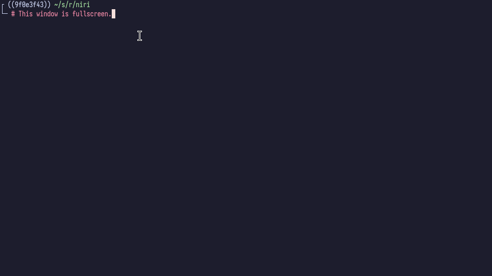
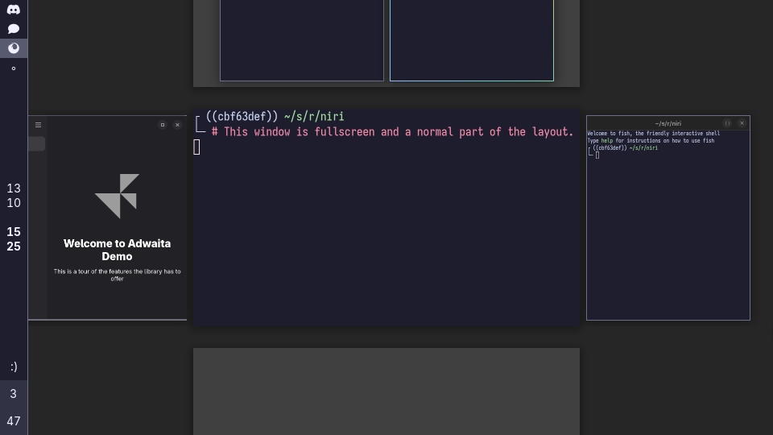

Tiri has one way to make a window big: fullscreen.
There is no maximized state, the same as in i3 and sway.

## Fullscreen windows

Windows can go fullscreen, usually seen with video players, presentations, or games.
You can force this via `fullscreen-window`, which is bound to <kbd>Mod</kbd><kbd>F</kbd> in the default config.

Fullscreen windows cover the entire screen.
Tiri renders a solid black backdrop behind them so fixed-size windows still sit on a fullscreen-sized surface, matching the Wayland protocol behavior.
When a fullscreen window is focused and not animating, it covers floating windows and the top layer-shell layer.
If you want notifications or launchers over fullscreen windows, configure them to use the overlay layer.

You can make a window open fullscreen, or prevent it from fullscreening on open, with the [`open-fullscreen`](./Configuration:-Window-Rules.md#open-fullscreen) window rule.

## Fullscreen does not change which side a window is on

A window keeps its side when it goes fullscreen.
A tiled window fullscreens in place, and a [floating window](./Floating-Windows.md) stays floating, exactly as sway's `container_set_fullscreen` leaves the container in the workspace list it was already in.
Leaving fullscreen restores the window to the size it had before, on the side it never left.

The workspace has a single fullscreen node, and it can name a node on either side.

These windows remain normal participants in the container tree.
You can still navigate to other windows with the regular focus and layout commands.

## There is no maximized state

Neither i3 nor sway has a maximize command, and tiri does not either.
A tiled window already fills the slot the layout gives it, and a floating window is the size you gave it, so there is nothing for a maximized state to mean.

Clients can still ask, since `xdg_toplevel.set_maximized` is part of the protocol.
Tiri answers the request with a configure and otherwise ignores it, which is what sway's `handle_request_maximize` does.
Tiri also does not advertise the maximize window-manager capability, so client-side titlebars will not draw a maximize button that does nothing.

If you are looking for a "make the focused thing big" action, it is <kbd>Mod</kbd><kbd>F</kbd>.

## Client fullscreen requests on open

Some clients ask to be fullscreen during their initial configure sequence.
That is the best time for tiri to honor or override those requests.
If a client requests the state only after the initial configure sequence, the relevant `open-*` rules may no longer affect it because, from tiri's point of view, the window is already open.

## Windowed fullscreen

Upstream niri: 25.05

Tiri can also tell a window that it's in fullscreen without actually making it fullscreen, via the `toggle-windowed-fullscreen` action.
This is generally useful for screencasting browser-based presentations, when you want to hide the browser UI, but still have the window sized as a normal window.

Window-side titlebar buttons and gestures may not work in this mode, since the window will always think that it's in fullscreen.

See also windowed fullscreen on the [screencasting features wiki page](./Screencasting.md#windowed-fakedetached-fullscreen).

[struts]: ./Configuration:-Layout.md#struts
[gaps]: ./Configuration:-Layout.md#gaps
